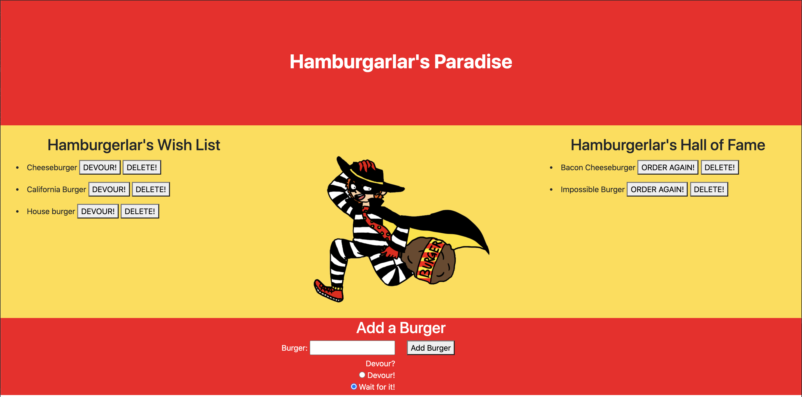

# hamburgerlar's paradise

## Summary
In this assignment, we were tasked with creating a server side application that used handlebars template engine, mysql, and ORM configuration. These principles work together to form the MVC (Models, Views, Controllers) paradigm. 

## Instruction

Navigate to the following Github repository:
    https://github.com/hsaddanathan/hamburgerlars-paradise.git

Across the top of the page, click on the Fork button on the right.

Once you have done this, you will see the repo copied within your Github account

Click the Green "Code" Button, and copy repo link. 

Open Terminal and run "git clone (Paste Link Here)"

Once repo has been cloned, you can run " code ." to open in Visual Studio Code. 

From there, open your terminal inside VS Code by using the keyboard shortcut "Ctrl + `. 

Next, type "npm install" to install dependencies.

Once you have done this, type "node server.js" to run the program and answer the prompts.

Then, you can navigate to http://localhost:8080. 

Alternatively, you can navigate to https://hamburgerlar-paradise.herokuapp.com/ and run the program from there.

## Technology Used
    * node.js
    * Javascript
    * Handlebars
    * Heroku
    * mySQL
    * JawsDB
## Demo

## Links

Hamburgerlar's Paradise Heroku App:
    https://hamburgerlar-paradise.herokuapp.com/

Hamburgerlar's Paradise GitHub Repo:
    https://github.com/hsaddanathan/hamburgerlars-paradise.git

Hamburgerlar's Paradise Video Demo:
    https://drive.google.com/file/d/16xHcCp4f6gMkNCWmuRt5lhGZ5Wz_hqYR/view?usp=sharing

## Contributors 
[@hsaddanathan](https://github.com/hsaddanathan)

## License
